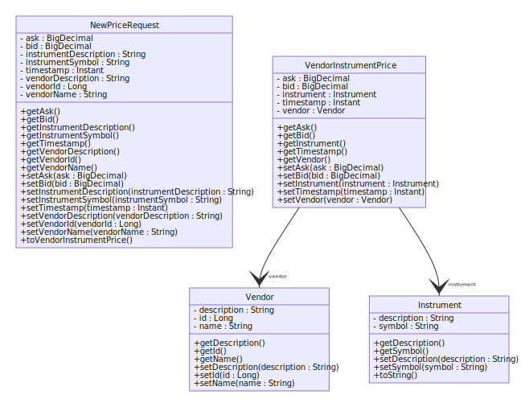
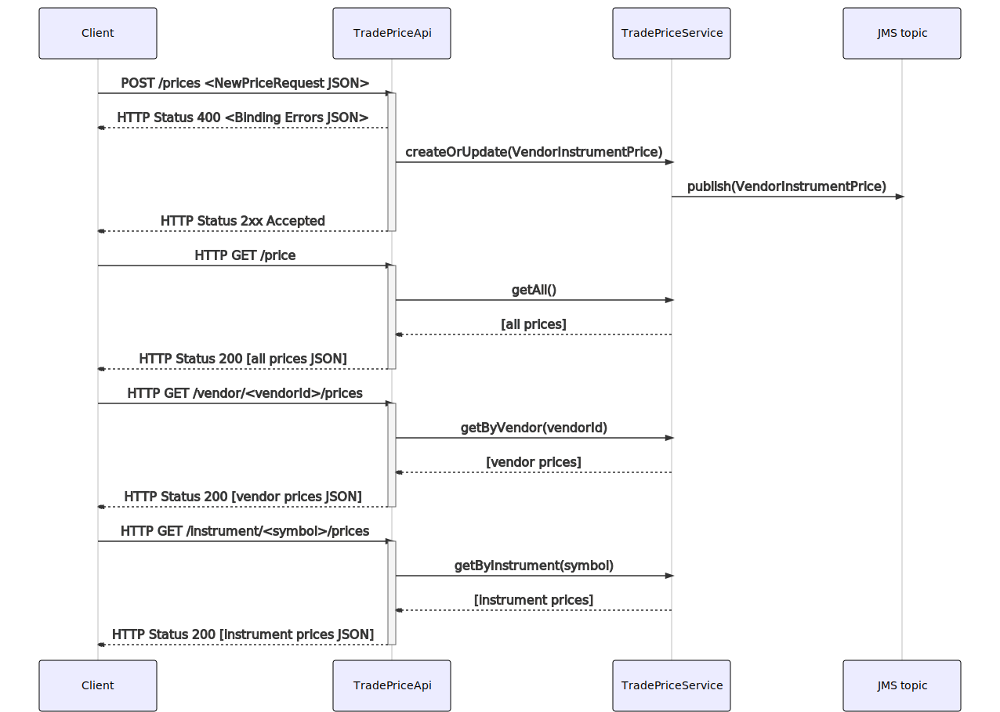
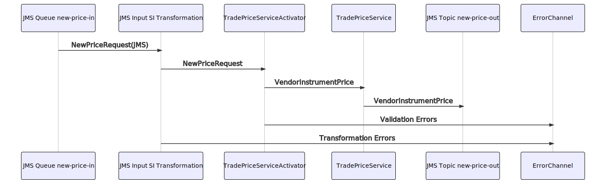
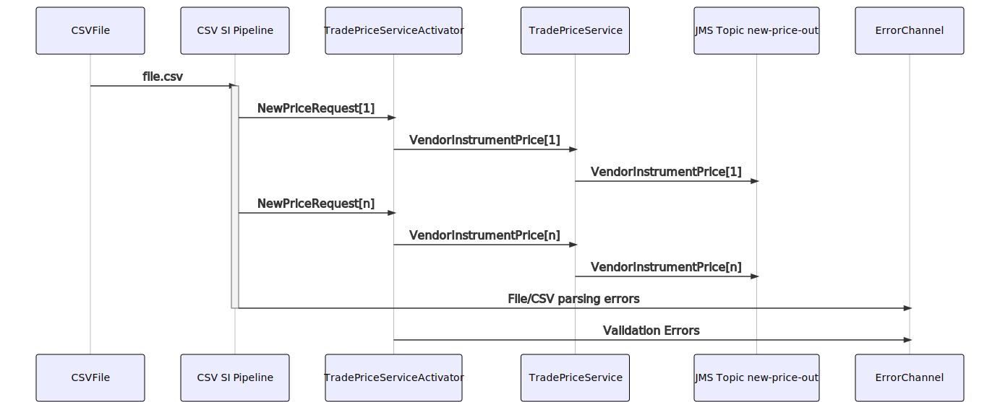

# Trade Price App

## What is does

This app accepts, caches and disseminates _vendor trade price information_ for traded instruments.
The basic unit of information is a **VendorInstrumentPrice** comprising
* The Vendor (who is offering a price)
* The Instrument (the product the price relates to)
* The bid/ask price (the buy/sell price the Vendor is offering for a given Instrument)
* A timestamp (The point the price is issued)

If a second price is provided for the same combination of **Vendor** and **Instrument**, then
the new price will __replace__ the old price in the cache.

Prices are accepted from 3 sources:
* A JMS queue
* A HTTP endpoint
* CSV files dropped in an appointed directory

When a new Price is accepted, it is 
  - added to the queryable in-memory cache
  - sent downstream via a JMS topic

The prices are evicted from the cache after a configurable amount of time (default 30 days)

# Installation Instructions
* **Prerequisites** Java(11 or later), Maven
* Check out the project with git `git clone https://github.com/monepic/trade-price-app.git`
* cd to the directory `cd trade-price-app`
* either run directly with maven by typing `mvn`
  or
  -  build the jar file with `mvn clean package` which will also run the tests and package the jar
  -  run the jar file `java -jar target/trade-price-app-0.0.1-SNAPSHOT.jar`
* the app is a Spring Boot jar and will run by default on http://localhost:8080 but that is configurable in the usual way

## Entity Model
The entity model consists of three principal classes **Vendor**,
**Instrument** and **VendorInstrumentPrice**.
A fourth class **NewPriceRequest** is effectively a form, populated by incoming JMS messages and incoming HTTP POST requests.
The **NewPriceRequest** gets validated before being transformed into the main model. 

In the diagram the constructors, `equals`, `hashCode` and `toString` methods are omitted for clarity


## REST API

### Supported Endpoints
##### Note: all endpoints produce/accept the content type `application/json`, so appropriate headers should be set

`GET /price`  - provides all cached prices

`POST /price` - submits a **NewPriceRequest**
 The expected format is  
```
{
  "vendorId":<vendorId>,
  "vendorName":"<vendorName>",
  "vendorDescription":"<vendorDescription>",
  "instrumentSymbol":"<symbol>",
  "instrumentDescription":"<instrumentDescription>",
  "bid":<bidPrice>,
  "ask":<askPrice>,
  "timestamp":<optional timestamp> 
}
```
If the optional `timestamp` field is provided, this is an idempotent operation, otherwise a timestamp is generated at submission

`GET /vendor/<vendorId>/prices` - returns prices offered by a specific Vendor

`GET /instrument/<symbol>/prices` - returns all Vendor prices offered for a specific Instrument

### Examples
* Submit new Price: 

    `curl -H "Content-Type: application/json" --data '{"vendorId":1,"vendorName":"SOME_VENDOR","vendorDescription":"Some Vendor","instrumentSymbol":"VOD","instrumentDescription":"Vodafone","bid":12.34,"ask":13.50}' localhost:8080/price -v` 

* Get Prices for Vendor 1: 

    `curl -H "Accept: application/json" localhost:8080/vendor/1/prices -v` 

### Notes
* Syntactical errors in requests will return a **400** response and a JSON object containing vailidation errors.

### HTTP Sequence flow


## JMS Input / Output
The application sets up a local ActiveMQ broker, although this could easily be subsituted for an external JMS broker.

One example input queue is set up: `new-price-in` upon which **NewPriceRequest** messages are consumed.  These messages are validated and
before being passed to the **TradePriceService**

Other input queues can easily be configured, for example per Vendor, or to cater for differing input formats.

The **TradePriceService** emits the details of any new price (from any source) on a JMS pub/sub topic called `new-price-out` to which interested parties can subscribe.
### JMS Sequence Flow


## CSV File Input
A polling inbound adapter is configured, which looks for files matchine `*.csv` in a folder configured by the application property `inbound.directory` (default `./filesIn`).  
An example file can be [found here](src/test/resources/test_good_file.csv).   
A Spring Integration pipeline splits this file, converts each line to a **NewPriceRequest** and sends it on to the TradePriceService, as approximated by this EIP diagram.
(The error path is not shown.)


As with the other flows, any errors encountered are sent to the **errorChannel**, which in this case simply logs the problem, although this channel can easily be connected to a DLQ for example.

The **CsvTokenizer** used by this pipeline is a very simple example, and could be replaced by a more robust implementation from e.g. Apache Commons.

### CSV Sequence Flow


## Persistence Implementation
The persistence layer is abstracted by the **TradePriceService** interface
and is easily pluggable to a different storage solution by implementing that interface.

Two implementations and a wrapper class are provided:
#### The [InMemoryFilteringTradePriceService](src/main/java/com/monepic/tradeprice/service/InMemoryFilteringTradePriceService.java)
(this will be used if the `filteredCache=true` application property is set)

This is the simplest implementation, which filters all the cached prices by Instrument or Vendor
every for every call to `getByVendor(v)` or `getByInstrument(i)`
This obviously incurs a performance penalty as more queries are performed.
We can't (easily) cache the results directly from these methods (e.g. with Spring's `@Cacheable`) as this
would potentially leave otherwise 'expired' prices in the cached collections returned from these methods.

#### The (default) [InMemoryIndexedCacheTradePriceService](src/main/java/com/monepic/tradeprice/service/InMemoryIndexedCacheTradePriceService.java)
This implementation delgates to a custom **[InMemoryIndexedCache](src/main/java/com/monepic/tradeprice/cache/InMemoryIndexedCache.java)**, which indexes the incoming data by some collection of arbitrary provided criteria.
The behaviour and concurrency considerations of this is discussed in more detail in the [Javadoc](src/main/java/com/monepic/tradeprice/cache/InMemoryIndexedCache.java#L10-L26).
The insertion performance is necessarily worse than for the filtering implementation, but the query performance will be better for
* large volumes of price data
* large numbers of concurrent queries

In both cases, an `expireOldPrices` method is provided which prunes the cache (and indexes) based on the configured validity period.
This is invoked via a cron schedule which is also configurable via the properties.

Prices that are techincally 'expired' can still show up in query results, due to the periodic nature of the cache eviction.
If it is imperative that an 'expired' price is __never__ provided in a query result, a secondary filtering would need to be implemented.

As both of these are in-memory implementations, they're not really suitable for practical production use.

#### JMS Publishing Wrapper 
A third wrapper class is provided, which sends out via JMS any new **VendorInstrumentPrice** that has been unexceptionally accepted by its delegate.

#### Recommendation
For a more prod-like implementation, I would consider using Redis due to its native support for [Secondary Indexing](https://redis.io/topics/indexes) 


## Future refinements

For further enhancements, I'd suggest to use TLS either configured at the loadbalancer level or by using the spring boot config.  
Authorization/authentication could be implemented using the standard Spring Security techniques.
I'd also suggest to separate out the concepts and persistence of the **Vendor** and **Instrument** static data.  
The data model could be enhanced to include more pertinent information, for example the currency - which is omitted in this application.  
It may make sense to separate the Spring Integration flows, REST API and Cache into different modules to facilitate scaling them independently.

As touched upon above, the app can easily be extended to process data from a variety of sources and in a variety of formats.
In real life, different Vendors are likely to define the format in which the data is provided and based on the examples here, that can be
accommodated with minimal effort. 
